# 基于分布式的云笔记（参考某道云笔记），数据存储在redis与hbase中

## 一、产品简述
云笔记是在吸收了多年的运营数据，经过精确的大数据分析指导需求模型的建立从而实现的，云笔记通过大数据分布式存储解决方案解决了笔记信息量膨胀的问题，并且通过分布式搜索引擎服务以及数据分析推荐平台的建立提升了用户搜索分享比较的能力，系统可以有针对性的提供用户其他人分享的笔记资源扩充自己的知识行囊，并且在分享之外通过每个人的配额管理实现了非分享笔记的安全私有化，保证了用户的私人空间。通过分布式解决方案用户空间被设计为无限大。业务端同时提供了windows客户端，更加贴近用户的使用习惯，并且数据平台支持移动设备的接入，达到无处不学习，无处不笔记的效果。

## 二、技术关键词
web平台：
- **nginx,keepalived+lvs ,tomcat,springmvc,jquery,fckeditor,mybatis,**
- **hadoop(hdfs,mapreduce),hbase,zookeeper,thrift,mysql,redis**

客户端：
- **windows**

## 三、设计理念
将云笔记信息分别存储在redis和hbase中。

**redis**（缓存）：存储每个用户的笔记本信息

**hbase**（持久层）：存储用户的笔记本信息、笔记本下的笔记列表、笔记具体信息。

## 四、库表设计

#### 1.笔记本
1.1 **redis**

 key     | value
-------- | ---
loginName | List&lt;String>

List&lt;string>: List&lt;笔记本的rowkey | 笔记本名称 | 时间戳 | status>

例子： List&lt;senfeng_134223232343|aaaddd|1401761871307|0>

1.2 **hbase**

表名：nb

rowkey ：  loginName_ timestamp

列簇1：noteBookInfo（nbi）：

列：
- notebookname（nbn）:笔记本名称
- createTime（ct）:创建时间
- status（st）:状态
- noteList（nl）：笔记本下的笔记列表，是个json串（noteRowKey|name| createTime| status）  

例子	senfeng403_1321312312	学习资料	123123123	1	{{“json1”}，{“json2”}}

#### 2.笔记
2.1**hbase**

表名：n

RowKey ： loginName_timestamp

列簇1:noteInfo(ni)：笔记信息

列： 
- notename（nn）：笔记的名字
- createTme（ct）：创建时间
- status（st）：笔记状态    

列簇2：ContentInfo（ci）：笔记本容信息

列：
- content（c）：笔记内容

例子	senfeng_1323242113	基础知识	1323242113	0	基础知识内容

3.创建hbase表语句
```
create 'nb','nbi'
create 'n','ni','ci'
```

## 五、功能描述
### 1.笔记本功能
#### 1.1创建笔记本：
点击全部笔记本右侧的"+"号，会出现填写笔记本名字的对话框
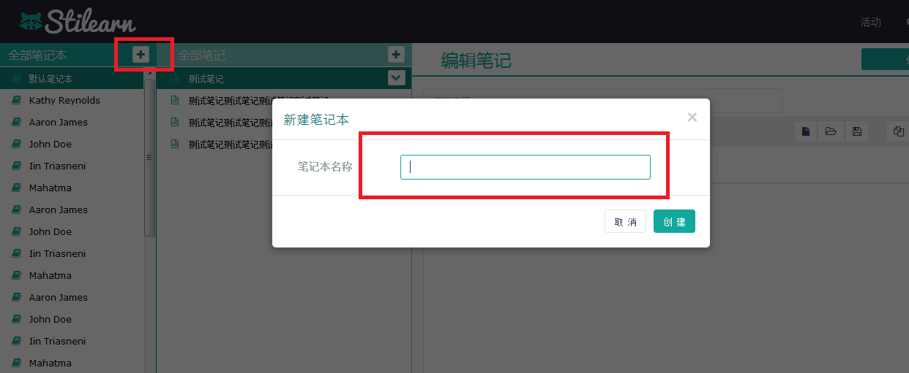
填写笔记名字后，点击创建，笔记本创建成功
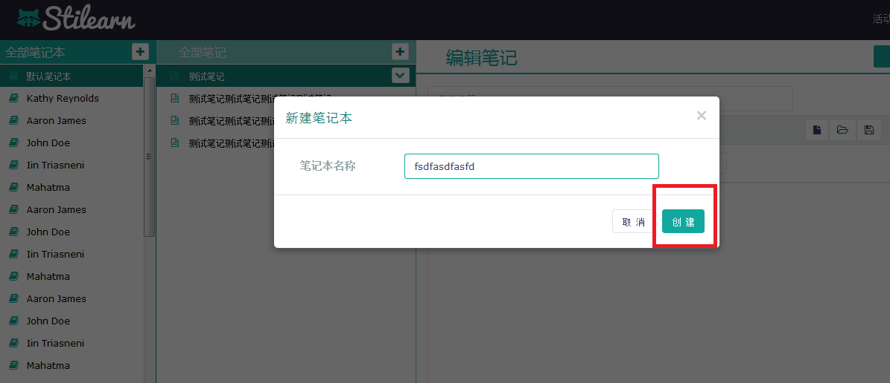

#### 1.2修改笔记本：
双击想要修改的笔记本，修改“笔记本”名字。
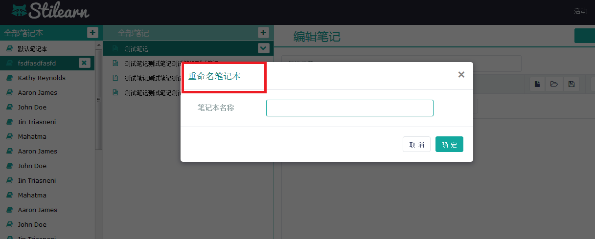

#### 1.3删除笔记本：
当“笔记本”下不存在笔记内容时，单击想要删除的笔记本，会出现“X”号。
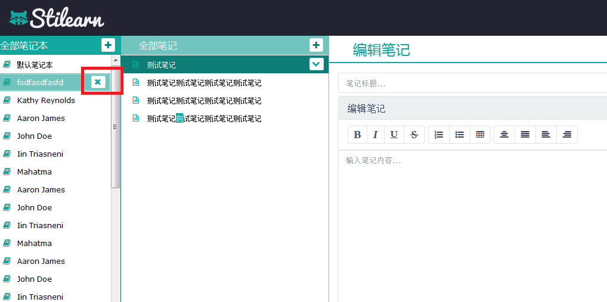
点击“X”号，会提示是否删除笔记本，点击“是”，笔记本将不进入回收站，直接删除。
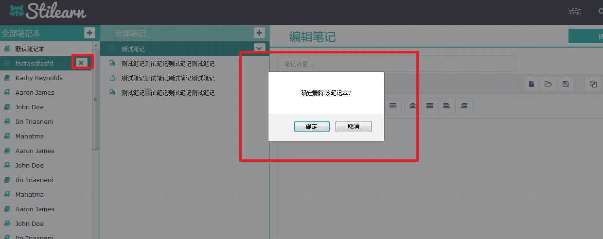
如“笔记本”下存在“笔记”，需要将笔记清空后方可删除“笔记本”。

### 2.笔记本功能
#### 2.1新建笔记：
点击相应笔记本，会在右侧显示该“笔记本”下的所有笔记，点击相应笔记右侧的“+”号，创建“笔记名字”，填写完毕，点击保存，笔记创建成功。
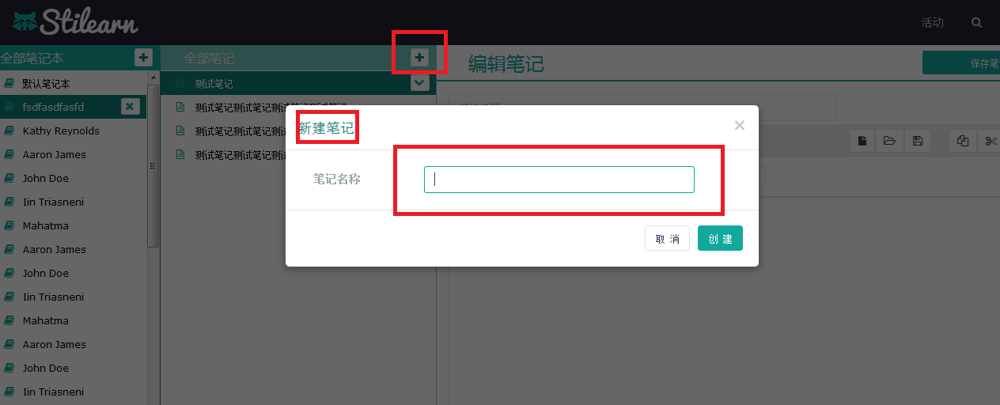

#### 2.2新建或修改笔记内容：
点击对应的“笔记”，会在内容栏出现“对应笔记”的内容， “添加”或“修改”笔记内容。
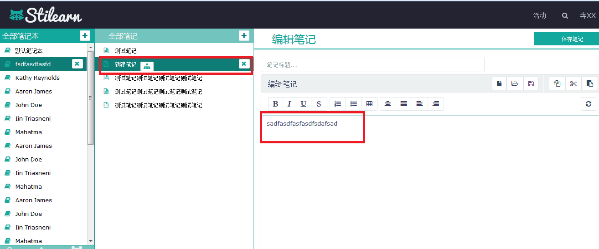
编辑结束，点击保存，笔记保存成功；不点击保存不予保存。
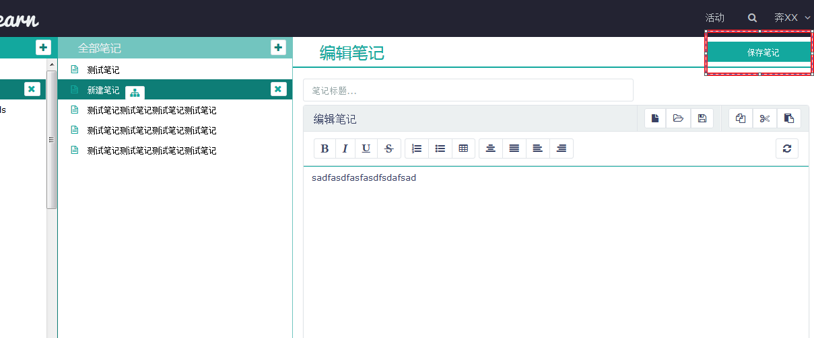

#### 2.3笔记分享：
点击相应笔记，会出现笔记状态，有“分享按钮”时为未公开的笔记。
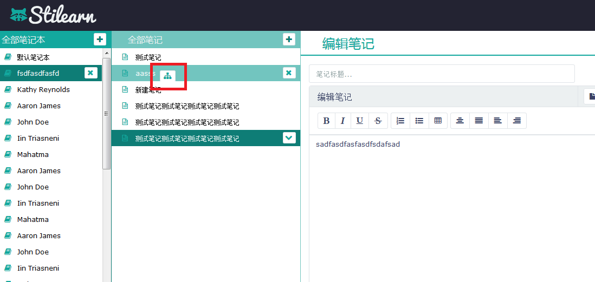
点击“分享按钮”，会将笔记变为分享状态（分享后的笔记不能取消分享），此时笔记分享成功。
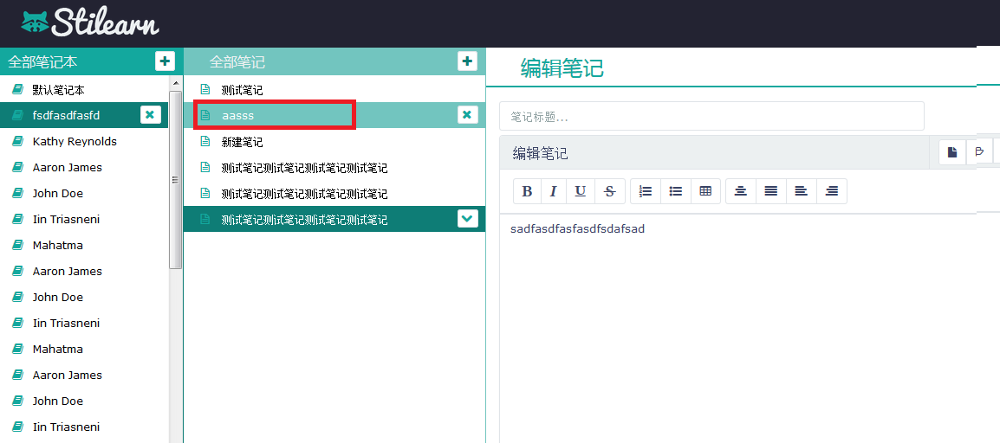

#### 2.4删除笔记：
点击相应笔记，在笔记标题右侧有“X”按钮，点击“X”按钮，会提示“是否删除此笔记？”，点击“是”，笔记进入“回收站”。
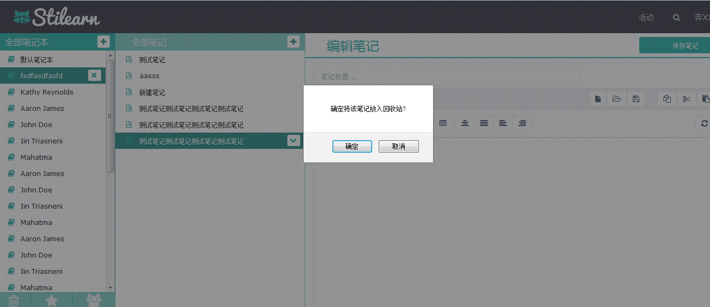

### 3.共享笔记查询功能
#### 3.1查询共享笔记：
在搜索共享笔记栏中，输入想要搜索的共享笔记关键字，会在“笔记栏”查询出共享笔记中符合查询条件的所有笔记。
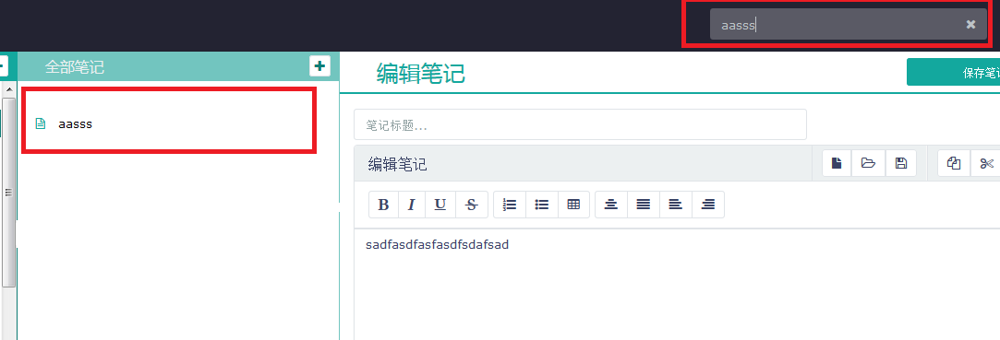

#### 3.2收藏共享笔记：
选中想要收藏的笔记，会在内容栏出现笔记内容，点击内容栏右侧的“收藏”按钮，会弹出“选择收藏笔记本”对话框，选择相应的笔记本，并点击“确定”，笔记收藏成功，笔记收藏后为共享状态，并且可以在本地“编辑”和“保存”。
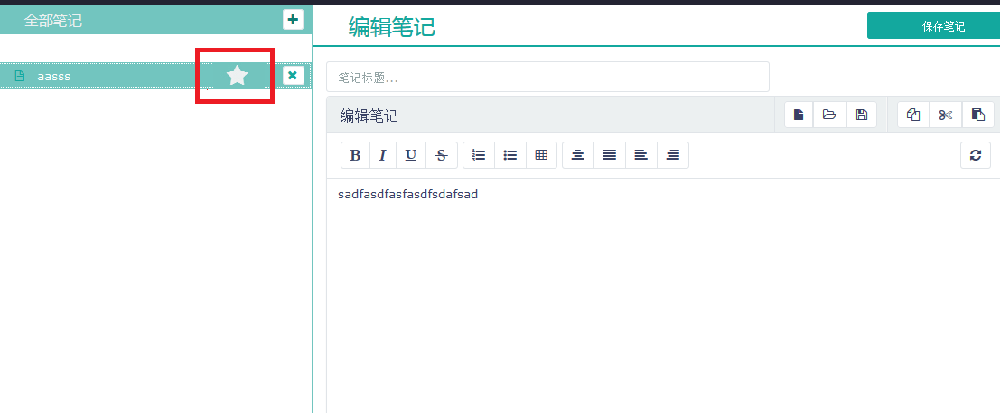

### 4.回收站
#### 4.1恢复笔记：
点击“回收站”，会在笔记栏列出已经删除的 “笔记”，点击想要恢复的 “笔记”，点击标题右侧的“恢复”按钮，会弹出提示框，提示想要恢复到哪个“笔记本”，选择笔记本，点击回复，即可恢复。
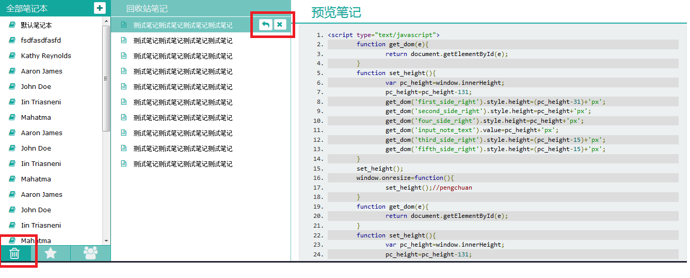

#### 4.2彻底删除笔记：
点击“回收站”，会在笔记栏列出已经删除的 “笔记”，点击想要彻底删除的 “笔记”，点击标题右侧的“垃圾箱”按钮，会弹出提示框，提示确定要彻底删除笔记吗，点击是，笔记彻底删除。
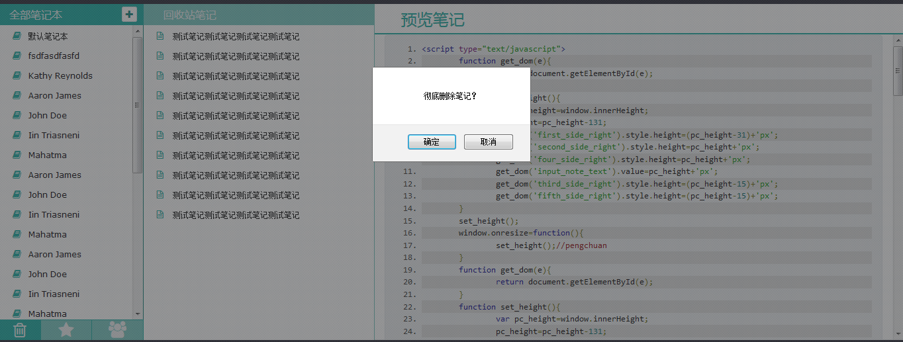
